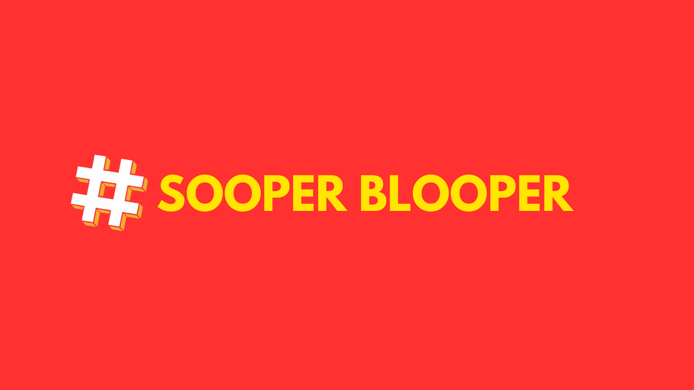

\<div align="center"\>
\
\<h1\>YOUTUBE-AGENCY\</h1\>
\<h3\>Unleash Viral Growth, Dominate YouTube Instantly\</h3\>
\</div\>

\<p align="center"\>
\
\
\
\</p\>

\<p align="center"\>
\
\
\
\
\
\
\</p\>

-----

## 📜 Table of Contents

  - [🚀 Overview](https://www.google.com/search?q=%23-overview)
  - [✨ Features](https://www.google.com/search?q=%23-features)
  - [📂 Project Structure](https://www.google.com/search?q=%23-project-structure)
  - [🏁 Getting Started](https://www.google.com/search?q=%23-getting-started)
      - [Prerequisites](https://www.google.com/search?q=%23prerequisites)
      - [Installation](https://www.google.com/search?q=%23installation)
  - [✍️ Blog Content](https://www.google.com/search?q=%23%EF%B8%8F-blog-content)
  - [🤝 Contributing](https://www.google.com/search?q=%23-contributing)
  - [📄 License](https://www.google.com/search?q=%23-license)
  - [📞 Contact](https://www.google.com/search?q=%23-contact)

-----

## 🚀 Overview

**SooperBlooper** is the official website for a premier YouTube growth agency. This project serves as the digital storefront and primary resource hub for creators, brands, and businesses aiming to enhance their YouTube presence. The site is a static build using HTML, CSS, and JavaScript, with a strong focus on providing valuable content through an extensive blog.

The agency specializes in data-driven strategies, content creation, and YouTube SEO to help clients achieve viral growth and dominate their respective niches on the platform.

-----

## ✨ Features

  - **Comprehensive Agency Information:** Details on who we are, our work process, and why clients should choose us.
  - **Extensive Blog:** A rich library of articles covering all aspects of YouTube growth, from SEO and content strategy to monetization and audience engagement.
  - **Responsive Design:** Fully optimized for a seamless experience on desktops, tablets, and mobile devices.
  - **Contact Form:** A functional contact form that captures user inquiries and sends the data to a Google Sheet via an Apps Script endpoint.
  - **SEO Optimized:** Includes `sitemap.xml`, `robots.txt`, and comprehensive meta tags to ensure high visibility on search engines.

-----

## 📂 Project Structure

```
/
|-- assets/         # Contains all images and branding materials
|-- blog/           # All individual blog post HTML files and their specific styles
|-- js/             # JavaScript files for including shared components
|-- .gitignore
|-- 404.html        # Custom 404 error page
|-- index.html      # The main landing page of the website
|-- package.json    # Project dependencies and build scripts
|-- script.js       # Main JavaScript for interactivity and form handling
|-- styles.css      # Main stylesheet for the website
|-- ... (other configuration files like sitemap.xml, robots.txt)
```

-----

## 🏁 Getting Started

To run this project locally, you will need to have Node.js and npm installed.

### Prerequisites

  - Node.js (which includes npm)

### Installation

1.  **Clone the repository:**
    ```sh
    git clone https://github.com/onkar-vaidya/youtube-agency.git
    ```
2.  **Navigate to the project directory:**
    ```sh
    cd youtube-agency
    ```
3.  **Install the necessary development dependencies:**
    ```sh
    npm install
    ```
4.  **Run the build script for Tailwind CSS:**
    This command will watch for changes in the `styles.css` file and compile them into `dist/output.css`.
    ```sh
    npm run build:css
    ```
5.  **Open `index.html` in your browser** to view the website. A tool like Live Server for VS Code is recommended.

-----

## ✍️ Blog Content

The blog is a cornerstone of this project, offering in-depth guides on a wide array of YouTube-related topics, including but not limited to:

  - **SEO and Discoverability:** `youtube-seo-ultimate-guide.html`, `how-to-do-keyword-research-for-youtube.html`.
  - **Content Strategy:** `content-strategy.html`, `how-to-choose-youtube-niche.html`.
  - **Monetization:** `monetization-strategies.html`, `1000-subs-4000-hours.html`.
  - **Beginner Guides:** `how-to-create-youtube-channel.html`, `youtube-equipment-guide.html`.

-----

## 🤝 Contributing

Contributions are welcome\! If you have suggestions for improving the website or adding new features, please feel free to fork the repository and submit a pull request.

1.  Fork the Project
2.  Create your Feature Branch (`git checkout -b feature/NewFeature`)
3.  Commit your Changes (`git commit -m 'Add some NewFeature'`)
4.  Push to the Branch (`git push origin feature/NewFeature`)
5.  Open a Pull Request

-----

## 📄 License

This project is licensed under the ISC License.

-----

## 📞 Contact

Onkar Vaidya - [GitHub Profile](https://www.google.com/search?q=https://github.com/onkar-vaidya)

Project Link: [https://github.com/onkar-vaidya/youtube-agency](https://www.google.com/search?q=https://github.com/onkar-vaidya/youtube-agency)
